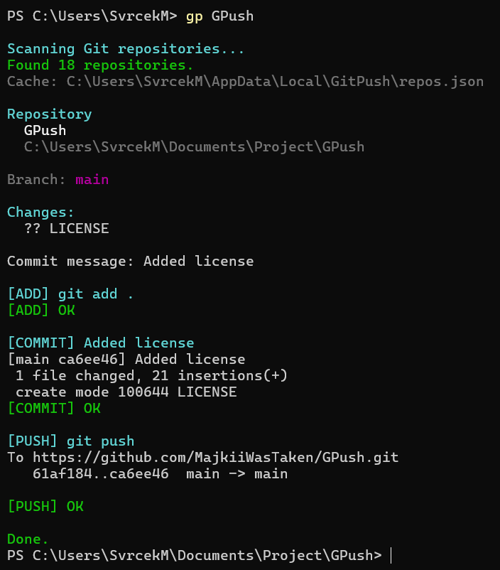

# GitPush


A small PowerShell utility for quickly finding Git repositories, creating commits, and pushing changes without manually navigating between project directories.

GitPush scans configured directories for Git repositories, lets you select a project by name, stages all changes, creates a commit, and pushes it to the remote repository.

If the remote branch contains newer commits and the push is rejected, GitPush automatically attempts a `git pull --rebase` and retries the push.

---

### Features

- Automatically scans configured directories for Git repositories
- Caches discovered repositories
- Search repositories by partial name
- Interactive selection when multiple repositories match
- Displays the current Git branch
- Displays modified, added, and deleted files
- Automatically runs `git add .`
- Creates commits directly from the terminal
- Pushes changes to the configured remote
- Automatically handles rejected pushes using `git pull --rebase`
- Stops safely when a merge/rebase conflict requires manual resolution
- Ignores common build and dependency directories while scanning
- Colored terminal output

---

### Requirements

- Windows
- PowerShell
- Git installed and available in `PATH`

Verify that Git is available:

```powershell
git --version
```

---

### Installation

Clone or download this repository.

For example:

```powershell
git clone https://github.com/MajkiiWasTaken/GPush.git
```

Open `gp.ps1` and configure the directories containing your Git repositories:

```powershell
$SearchRoots = @(
    "$HOME\Documents\Projects"
    # "$HOME\source\repos"
    # "D:\Projects"
    # "C:\Git"
)
```

You may specify multiple directories:

```powershell
$SearchRoots = @(
    "$HOME\Documents\Projects"
    "$HOME\source\repos"
    "D:\Work"
)
```

---

### PowerShell command

To use GitPush as the `gp` command, add the following to your PowerShell profile:

```powershell
Remove-Item Alias:gp -Force -ErrorAction SilentlyContinue

function Global:gp {
    & "C:\Path\To\GitPush\gp.ps1" @args
}
```

`gp` is normally a PowerShell alias for `Get-ItemProperty`, therefore the original alias has to be removed before the GitPush function can use the same name.

To open your PowerShell profile:

```powershell
notepad $PROFILE
```

If the profile does not exist:

```powershell
New-Item -ItemType File -Path $PROFILE -Force
notepad $PROFILE
```

After modifying the profile, reload it:

```powershell
. $PROFILE
```

This is only required after changing the profile. PowerShell automatically loads the profile when a new terminal session starts.

---

### Usage

Search for a repository:

```powershell
gp lorem
```

GitPush scans the configured directories and finds repositories whose names match the query.

If exactly one repository matches, it is selected automatically.

If multiple repositories match:

```text
Multiple repositories found:

[1] Test
    C:\Users\User\Documents\Projects\Test

[2] TestProject
    C:\Users\User\Documents\Projects\TestProject

Select repository:
```

Enter the number of the repository you want to use.

### Commit interactively

Run:

```powershell
gp lorem
```

If the repository contains changes, GitPush asks for a commit message:

```text
Commit message: Fix ethernet receiver
```

It then performs:

```text
git add .
git commit -m "Fix ethernet receiver"
git push
```

### Commit directly

The commit message may also be supplied directly:

```powershell
gp lorem Fixed something...
```

Everything after the repository name becomes the commit message.

Repository names containing spaces must be enclosed in quotes:

```powershell
gp "Test" Fix communication issue
```

You may also quote the commit message:

```powershell
gp "TestProject" "Fix communication issue"
```

---

### Repository scanning

GitPush recursively scans every directory configured in `$SearchRoots`.

When a `.git` directory or file is found, the parent directory is registered as a Git repository.

The following directories are ignored by default:

```text
node_modules
bin
obj
.venv
venv
target
packages
.vs
.idea
```

This prevents GitPush from wasting time scanning dependency folders and build output directories.

---

### Cache

The repository list is stored in:

```text
%LOCALAPPDATA%\GitPush\repos.json
```

The cache is refreshed every time GitPush starts.

This means newly created or deleted repositories are automatically reflected on the next run.

---

### Push conflicts

GitPush first attempts a normal:

```powershell
git push
```

If Git reports that the remote branch contains newer commits, GitPush automatically runs:

```powershell
git pull --rebase
```

and then retries:

```powershell
git push
```

If the rebase produces a conflict, GitPush stops and lets you resolve it manually.

After resolving the conflicting files:

```powershell
git add .
git rebase --continue
git push
```

To cancel the rebase:

```powershell
git rebase --abort
```

GitPush intentionally does not attempt to resolve merge conflicts automatically.

---

### Example



---

### Author: Michal Švrček

This project can be distributed under the MIT License.